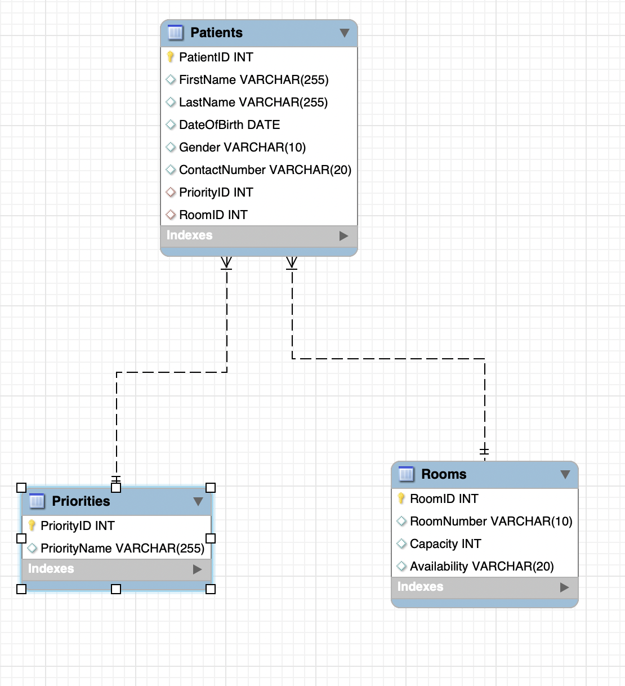

# Hospital Triage Database Design

## Entities Description:

1. Patients:
   - Data Type: Integer (Auto-increment)
   - Attributes:
     - PatientID (PRIMARY KEY): Unique identifier for each patient.
     - FirstName: First name of the patient.
     - LastName: Last name of the patient.
     - DateOfBirth: Date of birth of the patient.
     - Gender: Gender of the patient.
     - ContactNumber: Phone number of the patient.

2. Priorities:
   - Data Type: Integer (Auto-increment)
   - Attributes:
     - PriorityID (PRIMARY KEY): Unique identifier for each priority.
     - PriorityName: Name of the priority level (e.g., High, Medium, Low).
     
3. Rooms:
   - Data Type: Integer (Auto-increment)
   - Attributes:
     - RoomID (PRIMARY KEY): Unique identifier for each room.
     - RoomNumber: Room number in the hospital.
     - Capacity: Maximum number of patients the room can hold.
     - Availability: Availability status of the room (e.g., Occupied, Available).

## Attributes Specification:

For Patients entity:
- PatientID (PRIMARY KEY): Integer (Auto-increment)
- FirstName: String
- LastName: String
- DateOfBirth: Date
- Gender: String
- ContactNumber: String

For Priorities entity:
- PriorityID (PRIMARY KEY): Integer (Auto-increment)
- PriorityName: String

For Rooms entity:
- RoomID (PRIMARY KEY): Integer (Auto-increment)
- RoomNumber: String
- Capacity: Integer
- Availability: String

## Relationships:

- Each patient is assigned a priority level. Therefore, there is a relationship between Patients and Priorities.
  - Foreign Key: PriorityID (Patients table) references PriorityID (Priorities table).

- Patients can be admitted to rooms. Hence, there is a relationship between Patients and Rooms.
  - Foreign Key: RoomID (Patients table) references RoomID (Rooms table).

## [Database Schema](schema.png)

